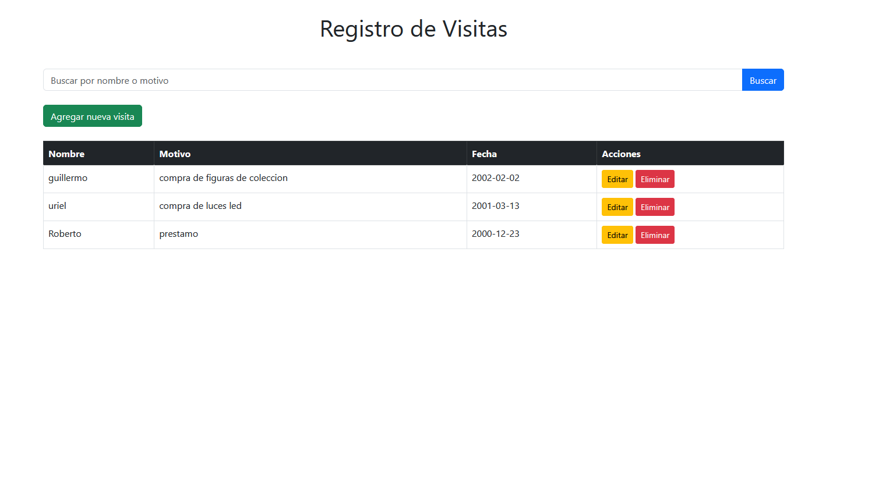
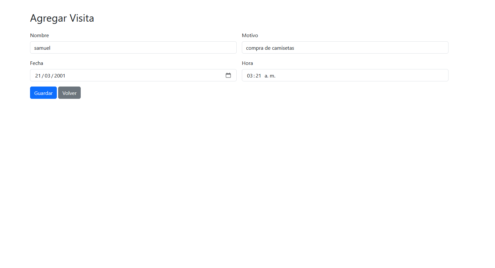
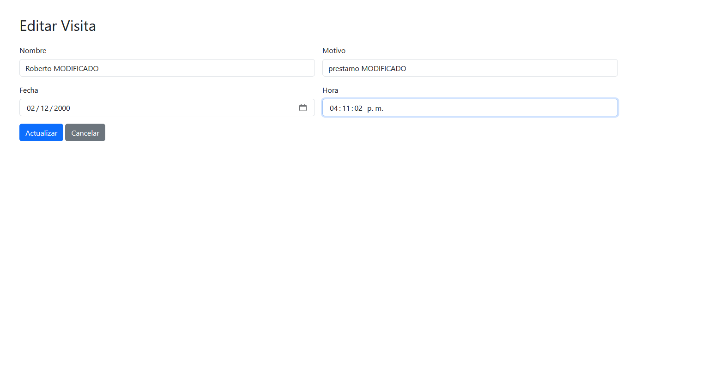
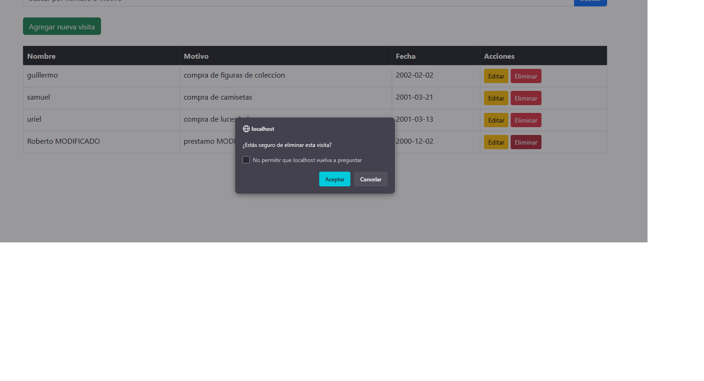
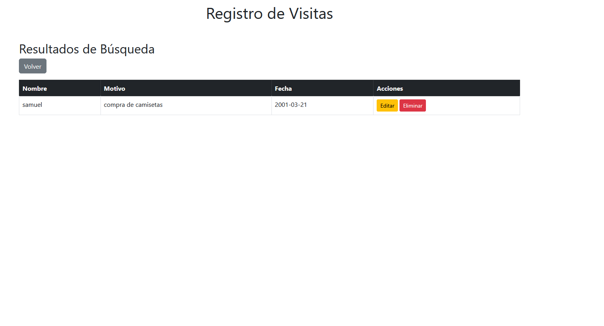
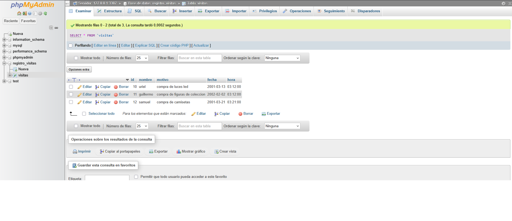

# Registro de Visitas

Este es un sistema básico de registro de visitas desarrollado en PHP con Bootstrap y MySQL. Permite registrar, buscar, editar y eliminar visitas realizadas a una empresa o institución.

## Características

- Agregar nuevas visitas
- Listar todas las visitas registradas
- Buscar visitas por nombre o motivo
- Editar y eliminar visitas
- Interfaz con Bootstrap 5
- Conexión a base de datos MySQL

## Requisitos

- XAMPP o similar con Apache y MySQL
- PHP 7.4 o superior
- Navegador moderno
- MySQL Workbench (opcional, para gestionar la base de datos)

## Vista del proyecto









## Instalación

1. Clona este repositorio o copia los archivos a la carpeta `htdocs` de XAMPP:
C:\xampp\htdocs\registro-visitas

2. Asegúrate de que el servidor MySQL esté activo. Usa `phpMyAdmin` para crear la base de datos.

3. Ejecuta el siguiente script SQL para crear la base de datos y la tabla:

```sql
CREATE DATABASE IF NOT EXISTS registro_visitas;
USE registro_visitas;

CREATE TABLE visitas (
  id INT AUTO_INCREMENT PRIMARY KEY,
  nombre VARCHAR(100) NOT NULL,
  motivo VARCHAR(255) NOT NULL,
  fecha TIMESTAMP DEFAULT CURRENT_TIMESTAMP
);
```
4. Configura el archivo includes/db.php con tus datos de conexión. Si tu puerto de MySQL es 3307, usa:
$mysqli = new mysqli("localhost", "root", "", "registro_visitas", 3307);

5. Accede desde tu navegador:
http://localhost/registro-visitas/index.php

Estructura del Proyecto
registro-visitas/
├── includes/
│   ├── db.php
│   └── header.php
├── visitas/
│   ├── agregar_visita.php
│   ├── editar_visita.php
│   └── eliminar_visita.php
├── buscar.php
├── index.php
├── .gitignore
├── README.md

👨‍💻 Autor

Christopher Eduardo Valdivia Baca
📍 Estudiante de Computación e Informática — Cibertec Callao
🔗 LinkedIn
📧 eduardovaldivia130@outlook.es
📱 +51 953 587 619
